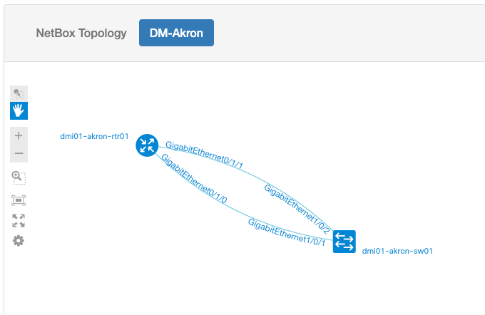

<p align=center></p>

---
[](https://discord.gg/M2SkgSdKht)
[](https://github.com/netreplica/nrx/actions/workflows/systest.yml)

# nrx - netreplica exporter

**nrx** reads a network topology graph from [NetBox](https://docs.netbox.dev/en/stable/) DCIM system and exports as one of the following:

* [Containerlab](https://containerlab.dev) topology for container-based networking labs
* [Cisco Modeling Labs](https://developer.cisco.com/modeling-labs/) topology for VM-based labs
* Network visualization format for [Graphite](https://github.com/netreplica/graphite) or [D2](https://d2lang.com/)
* Graph data as a JSON file in [Cytoscape](https://cytoscape.org/) format [CYJS](http://manual.cytoscape.org/en/stable/Supported_Network_File_Formats.html#cytoscape-js-json)
* Any other user-defined format using [Jinja2](https://palletsprojects.com/p/jinja/) templates

It can also read the topology graph previously saved as a CYJS file to convert it into other formats.

This project is in early phase. We're experimenting with the best ways to automate software network lab orchestration. If you have any feedback, questions or suggestions, please reach out to us via the Netreplica Discord server linked above, [#netreplica](https://netdev-community.slack.com/archives/C054GKBC4LB) channel in NetDev Community on Slack, or open a github issue in this repository.

# Latest capabilities added

The latest releases have a significant set of the new capabilities:
* `0.5.0` PyPA packaging and distribution: `pip install nrx`
* `0.4.0` Ability to create new output formats without a need for **nrx** code changes
* `0.4.0` Mapping between NetBox platform values and node parameters via [`platform_map.yaml`](docs/platform_map.md) file
* `0.4.0` `$HOME/.nr` configuration directory with automatic initialization using `--init` argument

Find detailed release notes on the [Releases page](https://github.com/netreplica/nrx/releases).

# Table of contents

* [Capabilities](#capabilities)
* [Compatibility](#compatibility)
* [Prerequisites](#prerequisites)
* [How to install](#how-to-install)
* [How to configure](#how-to-configure)
   * [Command-line arguments](#command-line-arguments)
   * [Environmental variables](#environmental-variables)
   * [Configuration file](#configuration-file)
   * [Configuration directory](#configuration-directory)
* [Templates](#templates)
* [How to use](#how-to-use)
   * [Containerlab example](#containerlab-example)
   * [Cisco Modeling Labs example](#cisco-modeling-labs-example)
   * [Topology Visualization with Graphite](#topology-visualization-with-graphite)
* [Credits](#credits)
   * [Original idea and implementation](#original-idea-and-implementation)
   * [Copyright notice](#copyright-notice)

# Capabilities

Data sourcing capabilities:

* Connects to a NetBox instance over an API using a user-provided authentication token
* Exports a network topology graph with Devices that
    * belong to a Site specified with `--site` parameter
    * have a list of Tags specified with `--tags` paramater
* A combination of the two methods above is possible
* Only Devices with Roles from a customizable list will be exported
* Direct connections between Devices via Cables will be exported as topology edges
* Connections via Patch Panels and Circuits will be exported as well with help of NetBox [Cable Tracing API](https://docs.netbox.dev/en/stable/models/dcim/cable/#tracing-cables)
* Only Ethernet connections will be exported
* Device configurations will be rendered and exported if not empty
* As an alternative to sourcing live data from NetBox, imports a graph from a previously exported file in CYJS format

Export capabilities:

* Exports the graph as a Containerlab (Clab) topology definition file in YAML format
* Exports the graph as a Cisco Modeling Labs (CML) topology definition file in YAML format
* Exported device configurations can be used as `startup-config` for Containerlab and CML
* Exports the graph in formats for visualization with Graphite or D2
* User-defined output formats using Jinja2 templates
* Uses NetBox Device Platform `slug` field to identify node templates when rendering the export file
* Customizable mapping between NetBox Platform values and node parameters via `platform_map.yaml` file
* Creates mapping between real interface names and interface names used by the supported lab tools
* Calculates `level` and `rank` values for each node based on Device Role to help visualize the topology
* Exports the graph into CYJS format that can be later converted into a topology definition file, or used by 3rd party software

# Compatibility

The following software versions were tested for compatibility with `nrx`:

* NetBox `v3.4`-`v3.5`. For device configuration export, `v3.5` is the minimum version.
* Containerlab `v0.39`, but earlier and later versions should work fine
* Cisco Modeling Labs `v2.5`
* Netreplica Graphite `v0.4.0`

# Prerequisites

* Python 3.9+. In the commands below we assume you have `python3.9` executable. If it is under a different name, change accordingly.
* PIP

    ```Shell
    curl -sL https://bootstrap.pypa.io/get-pip.py | python3.9 -
    ```

* Virtualenv (recommended)

    ```Shell
    pip install virtualenv
    ```

# How to install

## PyPI package (recommended)

```Shell
mkdir -p ~/.venv
python3.9 -m venv ~/.venv/nrx
source ~/.venv/nrx/bin/activate
pip install nrx
```

## From source code (development)

After running the following commands, you will have a working `nrx` command in the current directory.

```Shell
git clone https://github.com/netreplica/nrx.git --recursive
cd nrx
python3.9 -m venv venv
source venv/bin/activate
pip install -r requirements.txt
```

# How to configure

**nrx** accepts the following configuration options, in the order of precedence:

1. [Command-line arguments](#command-line-arguments)
2. [Environmental variables](#environmental-variables)
3. [Configuration file](#configuration-file)

## Command-line arguments

Command-line arguments take the highest priority.

```
nrx --help
usage: nrx [-h] [-v] [-d] [-I [VERSION]] [-c CONFIG] [-i INPUT] [-o OUTPUT] [-a API] [-s SITE] [-t TAGS] [-n NAME]
           [--noconfigs] [-k | --insecure] [-f FILE] [-M MAP] [-T TEMPLATES] [-D DIR]

nrx - network topology exporter by netreplica

optional arguments:
  -h, --help                show this help message and exit
  -v, --version             show version number and exit
  -d, --debug               enable debug output
  -I, --init [VERSION]      initialize configuration directory in $HOME/.nr and exit. optionally, specify a VERSION to initialize with: -I 0.1.0
  -c, --config CONFIG       configuration file, default: $HOME/.nr/nrx.conf
  -i, --input INPUT         input source: netbox (default) | cyjs
  -o, --output OUTPUT       output format: cyjs | clab | cml | graphite | d2 or any other format supported by provided templates
  -a, --api API             netbox API URL
  -s, --site SITE           netbox site to export, cannot be combined with --sites
      --sites SITES         netbox sites to export, for multiple tags use a comma-separated list: site1,site2,site3 (uses OR logic)
  -t, --tags TAGS           netbox tags to export, for multiple tags use a comma-separated list: tag1,tag2,tag3 (uses AND logic)
  -n, --name NAME           name of the exported topology (site name or tags by default)
      --noconfigs           disable device configuration export (enabled by default)
  -k, --insecure            allow insecure server connections when using TLS
  -f, --file FILE           file with the network graph to import
  -T, --templates TEMPLATES directory with template files, will be prepended to TEMPLATES_PATH list in the configuration file
  -M, --map MAP             file with platform mappings to node parameters (default: platform_map.yaml in templates folder)
  -D, --dir DIR             save files into directory DIR (topology name is used by default). nested relative and absolute paths are OK
```

Note: for security reasons, there is no argument to pass an API token. Use either an environmental variable or a configuration file.

## Environmental variables

As an alternative to a configuration file, use environmental variables to provide NetBox API connection parameters.

```Shell
# NetBox API URL
export NB_API_URL='https://demo.netbox.dev'
# NetBox API Token
export NB_API_TOKEN='replace_with_valid_API_token'
```

## Configuration file

Use `--config <filename>` argument to specify a configuration file to use. By default, **nrx** uses `$HOME/.nr/nrx.conf` if such file exists. The sample configuration file is provided as [`nrx.conf`](nrx.conf). Detailed information on the configuration options can be found in [CONFIGURATION.md](docs/CONFIGURATION.md).

## Configuration directory

By default, **nrx** looks up for the following assets in the `$HOME/.nr` directory:

* Configuration file: `nrx.conf`, unless overridden by `--config` argument
* Templates: `templates`, which can be supplemented by additional paths with `--templates` argument

To initialize the configuration directory, run `nrx --init`. This will create the `$HOME/.nr` folder and populate it with a configuration file example and a compatible version of the templates.

# Templates

**nrx** renders all topology artifacts using [Jinja2](https://jinja.palletsprojects.com/en/3.1.x/) templates. The user points `nrx` to the set of templates to use with `--templates` parameter.

If `--templates` parameter is not provided, **nrx** will search for Jinja2 files in the `templates` folder in the current directory, as well as in `$HOME/.nr/templates`. You can also provide an alternative list of folders to search via `TEMPLATES_PATH` parameter in the [configuration file](#configuration-file).

Inside the template folders, the required Jinja2 files are taken from a subfolder matching the desired output format. For example, if the output format is `clab` for Containerlab, then templates are taken from `clab` subfolder. For Cisco Modelling Labs `cml` format the subfolder would be `cml`.

A user can create their own templates for any output format and store them in a subfolder with a format name they would use for `--output` argument. To make the new output format available to **nrx**, an entry describing basic properties of the format must be added to `formats.yaml` file in the `templates` folder.

To identify which template to use for each device in the topology, **nrx** uses the `slug` field of the device's **platform** field in NetBox. If a template with a name matching the platform `slug` exists, it would be used by default. Since naming of the platforms is unique for every NetBox deployment, it is not possible to create a generic library of templates that could work out-of-the box for all users. Instead, **nrx** uses a mapping file [`platform_map.yaml`](docs/platform_map.md) to identify which template to use for each platform, with possible additional parameters like value of the `image` tag for Containerlab nodes.

The full list of template search rules:

* `<format>/topology.j2`: template for the final topology file. Mandatory.
* `<format>/nodes/<kind>.j2`: templates for individual node entries in the topology file, with `default.j2` being mandatory as a fallback template.
* `<format>/interface_names/<kind>.j2`: templates for generating emulated interface names used by each `kind` with `default.j2` being a fallback template. Optional, as not all output formats need emulated interface names. For example, not needed for visualization output formats.
* `<format>/interface_maps/<kind>.j2`: templates for mappings between real interface names and emulated interface names used by this NOS `kind`. Optional, as not all `kinds` support such mappings.

The **nrx** repository includes a set of [netreplica/templates](https://github.com/netreplica/templates) as a submodule. See more details about available templates in the [templates/README.md](https://github.com/netreplica/templates).

Although you can always directly customize the templates according to your needs, the platform map file often provides less intrusive way. It should be used if you need to tell `nrx` which templates to use for the Device Platform values in your NetBox system. Also, you can override node images to be used instead of the names specified in the templates, as well as many other node parameters. See [Platform Map](docs/platform_map.md) for details.

# How to use

Start with activating venv environment

```Shell
source nrx39/bin/activate
```

## Containerlab example

1. Run `nrx --output clab` to export a topology graph from NetBox in Containerlab format. See [How to configure](#how-to-configure) for details. Here is an example of running `nrx` to export a graph for NetBox Site "DM-Albany" from [NetBox Demo](https://demo.netbox.dev) instance:

    ```Shell
    export NB_API_TOKEN='replace_with_valid_API_token'
    nrx --api https://demo.netbox.dev --templates templates --output clab --dir demo --site DM-Albany
    ```

2. Now you're ready to start the Containerlab topology. Here is the example for "DM-Albany" site

    ```Shell
    sudo -E containerlab deploy -t demo/DM-Albany.clab.yaml --reconfigure
    ```

3. Without `--output clab` argument, `nrx` will save data from NetBox as a CYJS file `<site_name>.cyjs`

    ```Shell
    export NB_API_TOKEN='replace_with_valid_API_token'
    nrx --api https://demo.netbox.dev --site DM-Albany --dir demo
    ```

5. If you have a CYJS file, run `nrx --input cyjs --file <site>.cyjs --output clab` to create a Containerlab topology file from the CYJS graph you exported in the previous step. For example, run:

    ```Shell
    nrx --input cyjs --file demo/DM-Albany.cyjs --templates templates --output clab --dir demo
    ```

## Cisco Modeling Labs example

1. Run `nrx --output cml` to export a topology graph from NetBox in CML format. See [How to configure](#how-to-configure) for details. Here is an example of running `nrx` to export a graph for NetBox Site "DM-Akron" from [NetBox Demo](https://demo.netbox.dev) instance:

    ```Shell
    export NB_API_TOKEN='replace_with_valid_API_token'
    nrx --api https://demo.netbox.dev --templates templates --output cml --dir demo --site DM-Akron
    ```

2. Now you're ready to start the "DM-Akron" topology in CML.

    * Open your CML Dashboard in a browser
    * Choose "IMPORT"
    * Use `DM-Akron.cml.yaml` as a file to import. The import status should be Imported.
    * Choose "GO TO LAB". In SIMULATE menu, choose START LAB
    * Use NODES menu to monitor the status of each node

3. Without `--output cml` argument, `nrx` will save data from NetBox as a CYJS file `<site_name>.cyjs`

    ```Shell
    export NB_API_TOKEN='replace_with_valid_API_token'
    nrx --api https://demo.netbox.dev --dir demo --site DM-Akron
    ```

4. If you have a CYJS file, run `nrx --input cyjs --file <site>.cyjs --output cml` to create a topology file from the CYJS graph you exported in the previous step. For example, run:

    ```Shell
    nrx --input cyjs --file demo/DM-Akron.cyjs --templates templates --output cml --dir demo
    ```

## Topology Visualization with Graphite

A combination of **netreplica** `nrx` and [`graphite`](https://github.com/netreplica/graphite) tools can be used to visualize NetBox topology data. Unlike typical plugin-based visualizers, this method can work with a standard NetBox instance without any plugins installed. You also don't need an administrative access to the NetBox host in order to use this type of visualization.

Follow a two-step process:

1. Export topology data from NetBox in the Graphite format: `nrx -o graphite`. For example, let's export "DM-Akron" site from the [NetBox Demo](https://demo.netbox.dev) instance:

    ```Shell
    export NB_API_TOKEN='replace_with_valid_API_token'
    nrx --api https://demo.netbox.dev --site DM-Akron --templates templates --output graphite
    ```

2. Start Graphite to visualize "DM-Akron" site:

    ```Shell
    TOPOLOGY="$(pwd)/DM-Akron.graphite.json"
    docker run -d -t --rm \
        --mount type=bind,source="${TOPOLOGY}",target=/htdocs/default/default.json,readonly \
        -p 8080:80 \
        --name graphite \
        netreplica/graphite:latest
    ```

    Open [http://localhost:8080/graphite](http://localhost:8080/graphite) to see the topology. If you're running Graphite on a remote host, or inside a VM, use this helper to show a working URL:

    ```Shell
    docker exec -t -e HOST_CONNECTION="${SSH_CONNECTION}" graphite graphite_motd.sh 8080
    ```

    The visualization should be similar to

    

    To stop Graphite, run

    ```Shell
    docker stop graphite
    ```


If you'd like to be able to switch between multiple exported topologies without restarting Graphite, use one of the methods described in [Graphite documentation](https://github.com/netreplica/graphite/blob/main/docs/DOCKER.md).

# Credits

## Original idea and implementation

This is a [NANOG-87 Hackathon](https://www.nanog.org/events/nanog-87-hackathon/) project. The original project [slides](https://docs.google.com/presentation/d/1-WcKsDuaFh3tozmTdTxGYXjMFuthRyevsRZbIc2j2Kw/edit?usp=sharing). The project team:

* [Alex Bortok](https://github.com/bortok)
* [Chip Gwyn](https://github.com/chipgwyn)
* [Toni Yannick Kalombo](https://github.com/tonikalombo)

The implementation is inspired by [ContainerLab random labs](https://gist.github.com/renatoalmeidaoliveira/fdb772a5a02f3cfc0b5fbe7e8b7586a2) by [Renato Almeida de Oliveira](https://github.com/renatoalmeidaoliveira).

## Device configuration export

We added capabilities to export device configurations at [NANOG-88 Hackathon](https://www.nanog.org/events/nanog-88-hackathon/). The project team:

* [Alex Bortok](https://www.linkedin.com/in/bortok/)
* [Mau Rojas](https://www.linkedin.com/in/pinrojas/)
* [Ahmed Elmokashfi](https://www.linkedin.com/in/elmokashfi/)

Watch [the demo of the project on YouTube](https://youtu.be/cP8PUr306ZM):

[](https://youtu.be/cP8PUr306ZM)

## Copyright notice

Copyright 2023 Netreplica Team

Licensed under the Apache License, Version 2.0 (the "License");
you may not use this file except in compliance with the License.
You may obtain a copy of the License at

   http://www.apache.org/licenses/LICENSE-2.0

Unless required by applicable law or agreed to in writing, software
distributed under the License is distributed on an "AS IS" BASIS,
WITHOUT WARRANTIES OR CONDITIONS OF ANY KIND, either express or implied.
See the License for the specific language governing permissions and
limitations under the License.